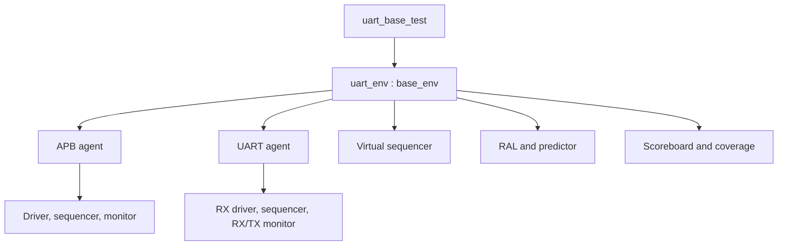

# Learning UVM through this project

Each class now has a matching file: open `uart_driver.svh` to read only the
driver, or `uart_ctrl_reg.svh` to read only the control register model. Use the
[class file map](07_class_file_map.md) to navigate. Package files show the include
order, and the supplied simulator file lists compile those packages.

## 1. Start with the problem

Software writes TXDATA. The UART must serialize that byte with the programmed
format. A separate sender drives RX. The UART must reconstruct each byte, store
it, expose it through RXDATA and report errors/interrupts correctly. These are
observable promises, so the checker should use external interfaces rather than
copying internal RTL state.

The register-only v1 example teaches the transport and RAL layers first. The
v2 example keeps those files and derives `uart_env` from `base_env`.

## 2. Structural hierarchy

The top module owns clocks, interfaces, DUT instantiation and initial reset.
Class objects access signals through **virtual interfaces**. A virtual interface
is a handle to the instantiated interface; it is not another copy of the pins.

## 3. Objects versus components

| Construct | Lifetime and role | Example |
| --- | --- | --- |
| `uvm_sequence_item` | Data for one operation | `apb_item`, `uart_item` |
| `uvm_sequence` | Task-based stimulus recipe | `uart_errors_vseq` |
| `uvm_object` | Configuration/model object | `uart_cfg`, RAL classes |
| `uvm_component` | Persistent node in UVM hierarchy | Driver, monitor, scoreboard |
| `uvm_test` | Chooses environment and scenario | `uart_random_test` |

Factory macros register a type. `type_id::create()` permits replacement by a
compatible type without changing the call site. Constructors alone do not offer
that override hook. Field macros in transaction objects provide printing,
copying and comparison; they do not implement hardware or drive pins.

## 4. Phases and configuration

`build_phase` creates children and retrieves settings. The top sets the APB and
UART virtual interfaces under `uvm_test_top.env`. `base_env` creates the bus
configuration and passes it to the bus agent. `uart_env` adds the serial agent.
Missing virtual interfaces are fatal immediately, not a later null-handle crash.

`connect_phase` joins TLM ports and assigns sequencer/model handles. Children
exist by then. `run_phase` contains time-consuming stimulus and monitoring.
`check_phase` detects leftover expected or received data. `report_phase` prints
counts and pass/fail information.

A run-phase **objection** keeps the simulation alive. The test raises one before
starting its virtual sequence and drops it after the sequence and bounded drain
finish. Drivers and monitors run forever without raising objections. Do not put
an objection around an infinite monitor loop.

## 5. Follow one TX operation

1. `transmit(8'h55)` waits until STATUS.TX_BUSY is clear.
2. `wr(regs.txdata, data)` requests a frontdoor RAL write.
3. The adapter makes an APB transaction; the bus sequencer arbitrates it.
4. The driver performs SETUP then ACCESS and waits for PREADY.
5. The APB monitor observes the completed transfer and broadcasts a new item.
6. The RAL predictor updates the mirror; the scoreboard queues expected `0x55`.
7. The independent UART monitor decodes TX and publishes the actual frame.
8. The scoreboard pops the oldest expected frame and compares data and errors.

The driver never tells the scoreboard “the DUT sent it.” Only the TX monitor can
provide that observation. Extra serial transmissions fail because there is no
matching expected write. Missing transmissions leave a queue entry at end of test.

## 6. Follow one RX operation

The serial driver sends a frame on RX. The RX monitor decodes actual pins,
including injected bad parity/stop bits. The scoreboard models a four-entry FIFO
from these observed frames. Successful RXDATA reads pop its oldest expected byte
and compare it with PRDATA. If six frames arrive without reads, only the first
four are retained and the overrun flag becomes sticky.

This is not a loopback test: TX and RX expectations are independent. The random
sequence sends one byte on TX and its complement on RX concurrently.

## 7. Sequencer versus virtual sequencer

The bus sequencer supplies APB items to a driver. The serial sequencer supplies
frames to the serial driver. The virtual sequencer has **no driver connection**;
it holds references to these sequencers, the RAL block and shared configuration.
The virtual sequence coordinates them. `fork...join` in the random sequence
creates concurrent directions; register calls still arbitrate through the bus
sequencer.

`uvm_declare_p_sequencer` provides a typed handle and catches running a UART
virtual sequence on an incompatible sequencer. The leaf serial sequence uses
`start_item/finish_item`; the driver uses `get_next_item/item_done`.

## 8. Timing and race avoidance

The APB driver changes request signals on falling edges. The RTL and APB monitor
sample rising edges before NBA updates. At the completion edge, the monitor
therefore sees the same read data that the master receives, including a FIFO
entry before a destructive read pops it. The driver returns the updated request
at the following falling edge, so monitor-based prediction finishes before the
next RAL operation.

The UART driver assigns RX with nonblocking assignments at falling edges. The
UART monitor samples falling edges. It detects the new start on the next sample
and uses bit-center samples. This avoids same-region drive/sample ordering
ambiguity. The RX synchronizer creates a small difference between pin decode and
register visibility; the architectural scoreboard has an explicit, bounded
settling window. See the scope document before testing commit-cycle collisions.

## 9. Scoreboard, assertions and coverage answer different questions

- The scoreboard checks architectural results and retained state.
- Assertions check local temporal rules, such as APB stability during waits.
- Functional coverage records which specified scenarios occurred.
- Code coverage records which RTL structures executed.

A coverage hit is not proof that the observed operation was correct. A clean
scoreboard is not proof that enough scenarios occurred. You need both. Never
report coverage closure from a static compile or a smoke test.

## 10. Debug a failure

Use one seed and the smallest failing test. Read the first UVM error, not just
the final failure count. For a receive mismatch, inspect the RX frame, then the
RXDATA read; for TX, inspect the accepted bus write and decoded frame. Examine
reset and configuration changes before assuming a serializer bug.

Useful report IDs: `RAL_WRITE`, `RAL_READ`, `READBACK`, `BUS_RESPONSE`, `SB_TX`,
`SB_RX`, `SB_DRAIN`, `IRQ`, `TX_TIMEOUT`, `APB_TIMEOUT`, `RESET_RX`.

## 11. Practice extensions

1. Add a test for a new payload pattern without editing any component.
2. Add a new coverpoint and identify the test that will hit each bin.
3. Temporarily invert one RTL TX data bit and confirm the scoreboard catches it.
4. Change RXDATA to return the newest FIFO entry and confirm FIFO tests fail.
5. Add a writable scratch register end-to-end: RTL, RAL, coverage, test and spec.
6. Replace APB with another bus while retaining UART serial checks.
7. Parameterize scoreboard FIFO depth and verify depths one and eight.
8. Implement an edge-timing monitor to measure baud error and minimum stop time.

Keep intentional mutations on a separate branch and restore correct RTL before
collecting regression results.
