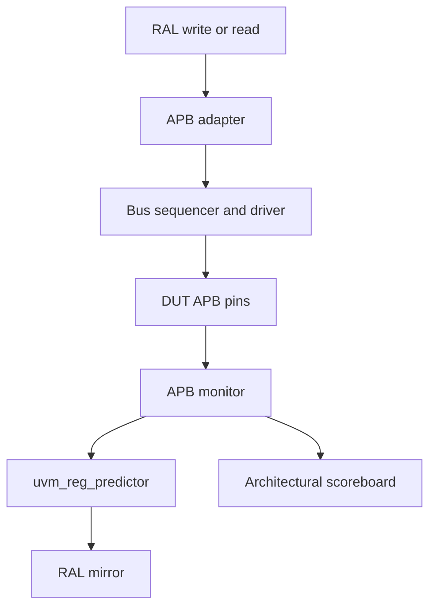

# Register abstraction layer: follow the actual code

The RAL classes describe register addresses, fields and access policies. They do
not implement RTL storage. `uart_reg_block` creates a four-byte little-endian map
with byte addressing and eight named register instances.

## Hardware, desired value, mirrored value

- Hardware value lives in the DUT.
- Desired value is the value the model wants hardware to contain.
- Mirrored value is the model's predicted view of hardware.

`set()` only changes desired state. `update()` writes when desired and mirrored
values differ. `write()` requests a real transfer. `read()` requests a real read.
`mirror(UVM_CHECK)` reads hardware and checks against the prior mirror where
comparison is enabled. None of these meanings makes an asynchronous status field
automatically track hardware.

## Wiring



In `uart_env.connect_phase`, `set_sequencer()` binds the map to APB transport,
`set_auto_predict(0)` disables implicit prediction, and `uvm_reg_predictor`
receives monitored transfers. Do not also enable auto-prediction: that creates
two prediction paths, which is especially dangerous with side-effect policies.

The adapter sets `provides_responses=0`, because the driver updates the original
request before `item_done()`. It translates an error response into `UVM_NOT_OK`.
The driver does not push an unconsumed response queue item.

## Frontdoor examples from the virtual sequences

```systemverilog
// Helper wr checks UVM status and specifies the map and parent sequence.
wr(p_sequencer.regs.baud, 16);
wr(p_sequencer.regs.ctrl, 1);       // enable, 8N1
wr(p_sequencer.regs.txdata, 'h55); // actual APB transfer

// A destructive FIFO read must be deliberate.
expect_reg(p_sequencer.regs.rxdata, 'haa);

// Change the desired field value, then synchronize it to hardware.
p_sequencer.regs.baud.divisor.set(16);
p_sequencer.regs.baud.update(status, UVM_FRONTDOOR,
    p_sequencer.regs.default_map, this);
```

The source includes the surrounding declarations and status checks. Run
`uart_ral_test` to exercise stable register reset values, walking-one writes,
mirror comparisons, set/update and illegal bus accesses.

## Why volatile fields use UVM_NO_CHECK

TX_BUSY and RX_VALID can change without a register write. RXDATA is a FIFO port:
its next read value changes when data arrives or an entry is popped. A bus-only
predictor cannot know all these transitions. The fields are marked volatile and
have mirror comparison disabled. The independent architectural scoreboard and
directed expected-value reads check them instead.

A RAL read of RXDATA updates the mirror with the byte just read; it does not
turn the model into a FIFO and does not predict the next byte. Do not call a
blanket register bit-bash or access sequence across FIFO and command registers.
The example deliberately tests stable RW registers separately.

## W1C and write-only command ports

ERR_CLEAR's fields are modeled as W1C while its address-map access is WO. The
model captures the meaning of a written one but cannot use this command port to
observe sticky flags. STATUS supplies those observations, and the scoreboard
updates its sticky-error state on successful ERR_CLEAR writes.

## Negative access tests bypass RAL policy

RAL prevents some illegal operations itself, such as writing a read-only map
entry. To verify that the **RTL** rejects them, `raw()` starts `apb_access_seq`
directly. It checks PSLVERR against the test's expectation. The regular bus
monitor still observes that access.

## Reset and backdoor

`regs.reset()` resets model state; it does not toggle the physical reset signal.
`apply_reset()` performs the hardware reset and then resets the model. Both are
necessary. There are intentionally no HDL-path backdoors in this example.
Backdoor reads bypass APB and can bypass side effects, which makes them unsuitable
for verifying FIFO pop behavior. Add a separate, documented backdoor policy only
when your IP requires it.
